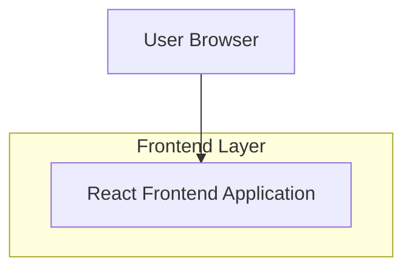

## 1.Architecture design

**Status:** READY for implementation (frontend-only styling + copy changes)

## 2.Technology Description
- Frontend: React@18 + tailwindcss@3 + vite
- Backend: None

## 3.Route definitions
| Route | Purpose |
|-------|---------|
| / | Landing page (academic palette + white, premium professional look; desktop-first responsive; “ERP” → “SIS”; module selection + copyright footer preserved) |
