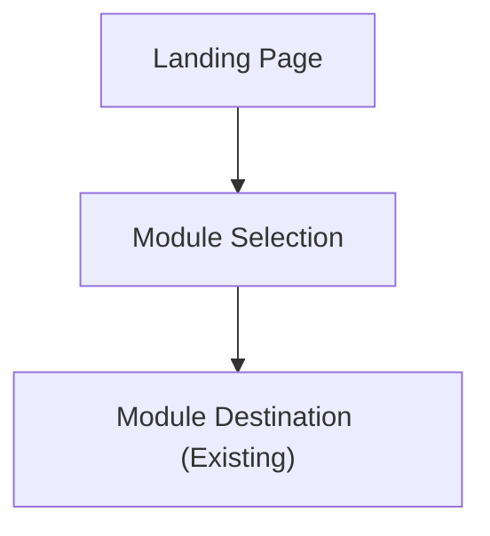

## 1. Product Overview
Redesign the existing SIS landing page with an academic (white-forward) color palette and a premium, professional look.
Keep existing behavior for module selection and retain the copyright footer; update copy by replacing “ERP” with “SIS”.

## 2. Core Features

### 2.1 Feature Module
Our landing page redesign requirements consist of the following main pages:
1. **Landing Page**: premium academic visual styling, responsive layout, updated “SIS” copy, module selection, copyright footer.

### 2.3 Page Details
| Page Name | Module Name | Feature description |
|-----------|-------------|---------------------|
| Landing Page | Visual styling refresh | Apply academic palette + generous white space; improve typographic hierarchy and spacing while staying consistent across sections. |
| Landing Page | Responsive layout | Adapt layout across mobile/tablet/desktop breakpoints (desktop-first); prevent overflow and horizontal scrolling. |
| Landing Page | Content wording update | Replace all user-visible occurrences of “ERP” with “SIS” in headings, body copy, CTAs, and supporting text. |
| Landing Page | Module selection | Display the module selection area as the primary interaction; allow selecting a module to proceed to the corresponding destination (existing behavior). |
| Landing Page | Copyright footer | Keep the existing copyright footer readable on all screen sizes; ensure it remains at the bottom of the page content. |

## 3. Core Process
User Flow:
1. You open the landing page.
2. You review the SIS messaging in the hero section.
3. You choose a module from the module selection area.
4. You are taken to the selected module’s existing destination.

## 4. Implementation Readiness (READY)

### 4.1 Definition of Done
- All user-visible occurrences of “ERP” are replaced with “SIS” on the landing page.
- Module selection behavior and destinations remain unchanged (no regressions).
- Footer remains present, readable, and visually consistent across breakpoints.
- Desktop-first responsive layout passes: Desktop (≥1024px), Tablet (768–1023px), Mobile (≤767px) with no horizontal scroll.
- Keyboard navigation works for module items (visible focus state); color contrast remains readable on white.

### 4.2 Acceptance Criteria
- Visual style matches “academic, white-forward, premium professional” intent (typography hierarchy + spacing improved).
- No new pages or flows are introduced; landing page remains the single entry surface.
